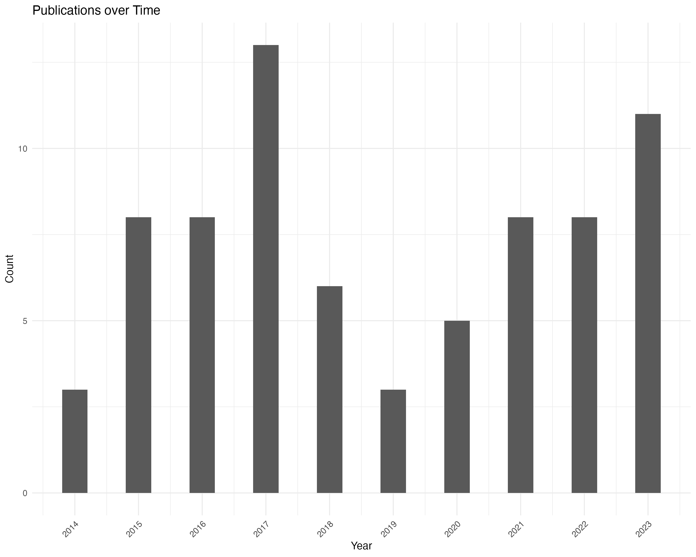

```{r setup, include=FALSE}
knitr::opts_chunk$set(echo = TRUE)
#install.packages("pak")
#install.packages("posterdown")
pak::pak('rstudio/pagedown')
library(dplyr)
library(readtext)
library(tidyverse)
library(gt)
library(ggplot2)
library(dplyr)
library(knitr)
library(readr)
library(kableExtra)
library(bibliometrix)
library(tidyverse)
library(DiagrammeR)
library(DiagrammeRsvg)
library(rsvg)
library(quanteda)
library(stringr)
library(tidytext)
library("quanteda.textmodels")
library("quanteda.textstats")
library("quanteda.textplots")
require(quanteda.corpora)
library(here)
here::i_am("poster-template.Rmd")
```

```{r, eval=F, include=FALSE}
pagedown::chrome_print("poster-template.Rmd")
```

# Abstract

# Overview


# Method

We explore the research literature relating to issues of youth recidivism in education.

Keywords used in analysis: keyword1, keyword2, keyword3

## Data

| Code | Criteria                                                                     |
|-------------------|-----------------------------------------------------|
| IC1  | Article contains study keywords in the title (TI) or abstract (AB)                 |
| IC2  | Article published between 2015 and 2024                                      |
| IC3  | Article originally written in English                                        |
| IC4  | Article is a journal article                                                 |
| IC5  | Article purpose or core questions center on the topical subjects of analysis |

: Inclusion and exclusion criteria for the study

## Analytic framework

This is some more sample text.

# Findings

```{r, include=F, message=F, warning=F}
data <- readtext("savedrecs-2.txt") # Load the data


M <- convert2df(file=data, dbsource= "wos", format= "plaintext")
dim(M)
M <- M  %>% 
  filter(PY > 2013) %>% 
  filter(PY < 2024)

# create an object of the study results
results <- biblioAnalysis(M, sep = ";") # entire data set

options(width=100)
S <- summary(object = results, k = 10, pause = F)
```

The main information about the study data.

```{r, echo=F, message=F, warning=F}
kable(S[2])
```

## Publications by Year

```{r, include=F, message=F, warning=F}
counts <- M %>%
  group_by(PY) %>%
  summarise(count = n())
```

```{r, include=F, message=F, warning=F}
year_plot <- ggplot() + 
  geom_col(data = counts, 
           aes(x = PY, y = count), width = 0.4) +
  theme_minimal() +
  labs(x = "Year", y = "Count", 
       title = "Publications over Time") +
  scale_x_continuous(breaks = seq(min(counts$PY), max(counts$PY), by = 1)) +
  theme(axis.text.x = element_text(angle = 45, hjust = 1),
        legend.title = element_blank(),
        legend.position = "top") 
print(year_plot)

# Save the plot as a high-resolution PNG
ggsave("img/year_plot.png", plot = year_plot, width = 10, height = 8, units = "in", dpi = 300, bg = "white")
```

{width=90%}

## Main Sources

```{r}
#| results: show
#| warning: false

kable(S[9]) # Main sources (journals)

```

## Keywords

```{r}
#| echo: false
#| results: show
#| warning: false

kable(S[10]) # Author Keywords and Keywords-Plus

```

## Most frequently cited documents

```{r}
#| results: show
#| echo: false
#| warning: false
# Most frequently cited documents in the collection
CR <- citations(M, field = "article", sep = ";")
kable(cbind(CR$Cited[1:21]))
```

## Most productive countries

```{r}
#| results: show
#| warning: false
kable(S[7])# Most productive countries

```

## Thematic Map and Frequency Analysis

```{r, echo=F}
Map1=thematicMap(M, field = "ID", n = 250, minfreq = 10,
  stemming = FALSE, size = 0.4, n.labels=5, repel = TRUE)
plot(Map1$map)
```


# Discussion

This is the discussion section [@alexander2021new].

This is the further discussion.

# Conclusion

This is some concluding text.

# Acknowledgements

These are the acknowledgements. This work was supporting by funding from the Alfred P. Sloan Foundation (Grant 2023-21062).

# References
